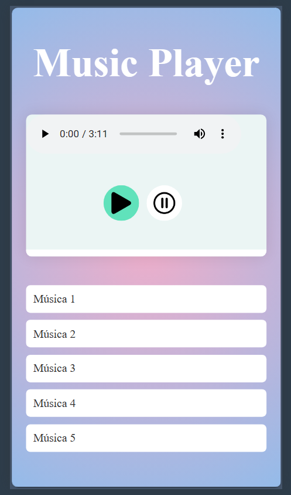

# Music Player 🎵

## Descrição do Projeto

O projeto "Music Player" é um player de música básico, mas poderoso. Ele oferece uma interface de usuário intuitiva e fácil de usar com várias funcionalidades essenciais para uma boa experiência.

## Funcionalidades

O Music Player inclui as seguintes funcionalidades:

- **Play**: Inicia a reprodução da música selecionada.
- **Pause**: Pausa a música que está sendo reproduzida.
- **Download**: Permite o download da música atual.
- **Controle**: Oferece controles para avançar ou retroceder na lista de reprodução.
- **Barra de Progresso**: Exibe o progresso da música atual.
- **Controle de Velocidade**: Permite ao usuário alterar a velocidade de reprodução da música.

## Tecnologias Utilizadas

- **HTML**: Utilizado para estruturar o conteúdo da página.
- **CSS**: Usado para estilizar a página e criar uma experiência de usuário agradável.
- **JavaScript**: Implementa toda a funcionalidade interativa do player de música.

## Como Usar

1. Clone este repositório para o seu local de trabalho.
2. Abra o arquivo `index.html` no seu navegador.
3. Carregue suas músicas favoritas e aproveite!

## Contribuição

Contribuições são sempre bem-vindas! Sinta-se à vontade para abrir uma issue ou enviar um pull request.

## Licença

Este projeto está licenciado sob a licença MIT.
